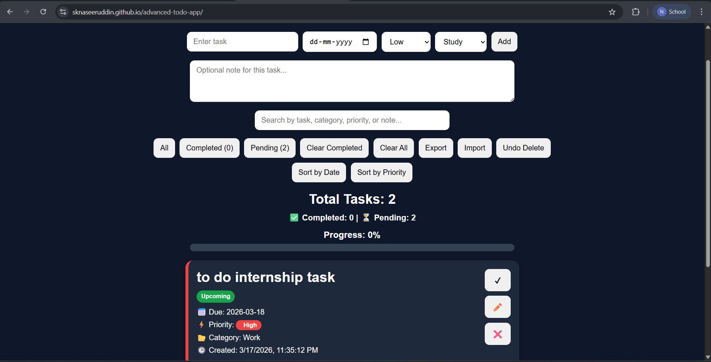

# 📝 Advanced To-Do App
## 📸 Preview

A modern and fully featured task management web application built using HTML, CSS, and JavaScript.  
This app helps users organize tasks efficiently with a clean UI and powerful functionality.

---

## 🚀 Features

- ✅ Add, Edit (Modal), Delete Tasks  
- 🔄 Undo Delete Functionality  
- 📅 Due Dates with Overdue / Today / Upcoming Indicators  
- ⚡ Priority Levels (High, Medium, Low)  
- 📂 Task Categories  
- 📝 Notes Support  
- 🔍 Search with Highlight  
- 🎯 Filter (All / Completed / Pending)  
- 📊 Progress Bar & Task Statistics  
- 🔃 Drag & Drop Task Reordering  
- 📤 Export Tasks (JSON File)  
- 📥 Import Tasks (JSON File)  
- 🌙 Dark / Light Mode  
- 💾 Data Stored using LocalStorage  
- ⌨️ Keyboard Shortcut (Ctrl + Enter)  
- 📱 Fully Responsive Design  

---

## 🛠️ Tech Stack

- HTML5  
- CSS3  
- JavaScript (Vanilla JS)  
- LocalStorage API  

---

## 📂 Project Structure
